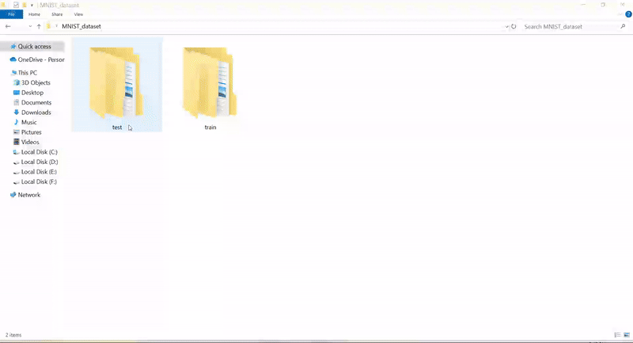

# MNIST_dataset

## Description
Create MNIST dataset (with images)

- image size: `28 x 28`
- train shape: `(56000, 785)`
- test shape:  `(14000, 785)`

## How to use it
1. first download `mnist_784.csv` from [here](https://datahub.io/machine-learning/mnist_784#data), and put it in this folder(
`MNIST_dataset/`)
2. RUN `create_mnist_dataset.ipynb`

## Screenshot

    

